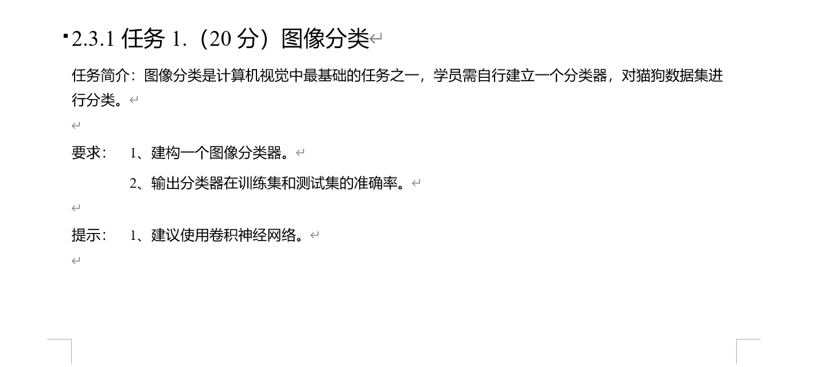
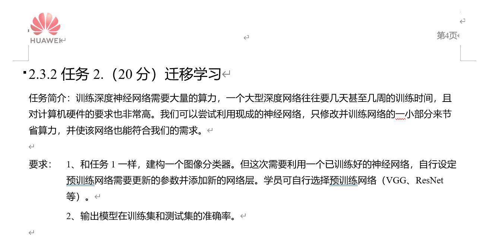

# SEU-CSE-CVProject
This project is the SEU(SouthEast University) CSE(Computer Science and Engineering)'s  Computer Vision Class's final Course lab.

The course lab include three parts, and in summer school, we only need to do first two parts.

And this project only includes the part2.
Followings are the tasks' description.

For each part, you may need to change the path of the dataset.

And followings are the brief descriptions of the scripts.

***GetPhotoPaths***
This script is used to get all datas' paths, and write them into the txt.  
***DataProcesser***
This script is used to process the data to fit the net.
***Net***
This script is used to download the VGG Net, and modify some parameters of it.
***TrainModel***
This script is used to use the data to train the downloaded model and save the trained model.
***TestSetTest && TrainSetTest***
The two scripts are used to test the accuracy of the trained model by Trainset and the Testset. 

#Instructions for use
* First you need to get data's paths by ***GetPhotoPaths***, and then you can run the ***TrainModel*** to get the trained model(this script includes downloading the model and modify its parameters). Finally,you can run the two test scripts to get the accuracy of your trained model.

***Good luck***